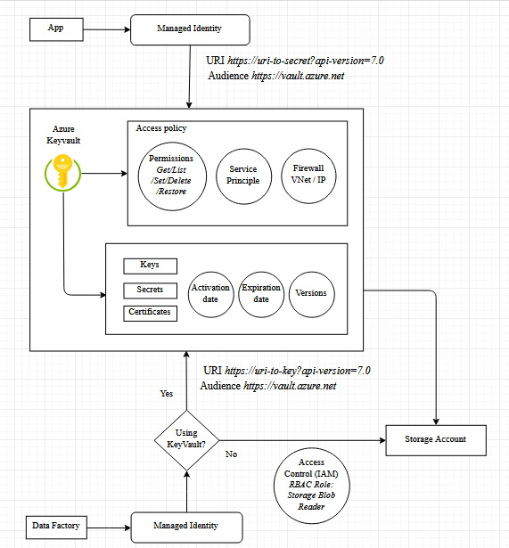

# Azure-Sample-KeyVault

The idea here is to build an API app that can read a secret from Azure KeyVault using managed identity. I am using azure SDK for this which makes managed identity work flow really simple. Basically you don't have to worry about the token that managed identity gets from the Azure AD and verification of that token by the Azure KeyVault. For the local development, the SDK will use azure cli to bypass managed identity. So make sure you have the Azure cli installed in your computer. However, you also need to make sure that the secret exists and azure keyvault has an access policy for your username. Finally you can deploy the app and test it on the azure app service.

